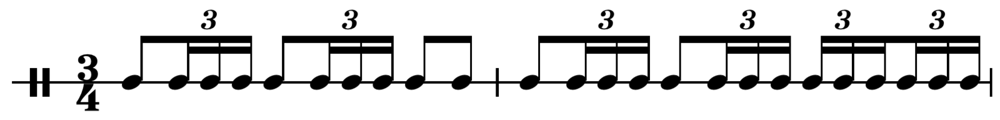
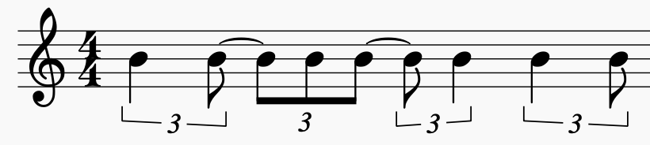
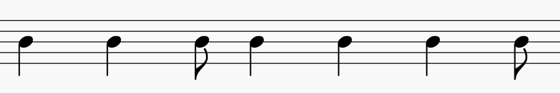
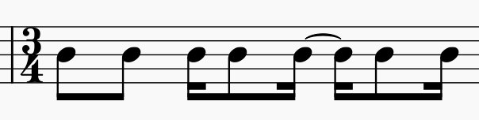
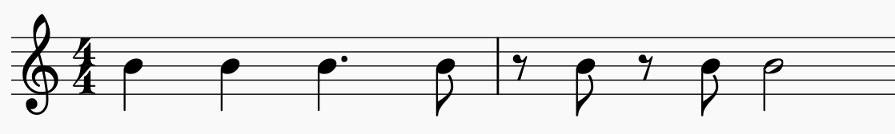
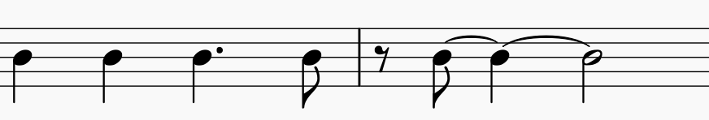
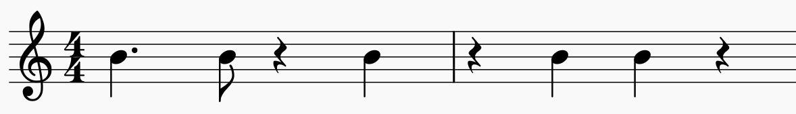
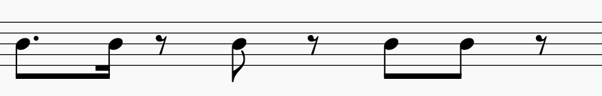
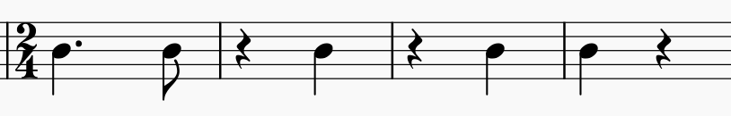
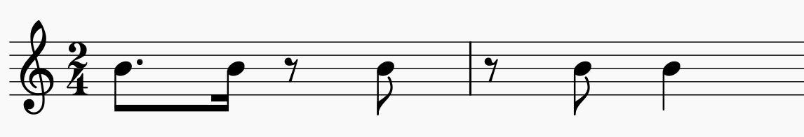

# rhythmical

This lib is able to parse and manipulate musical rhythms by using nested arrays and algebraic fractions.

## Example Showcase

Here are some example usages of the lib, to get you hooked.

### Example 1: Rendering for playback

Lets spell the famous bolero rhythm in nested notation:

```js
const bolero = [
  // bar 1
  [
    [1, [1, 1, 1]], // beat 1
    [1, [1, 1, 1]], // beat 2
    [1, 1] // beat 3
  ],
  // bar 2
  [
    [1, [1, 1, 1]], // beat 1
    [1, [1, 1, 1]], // beat 2
    [[1, 1, 1], [1, 1, 1]] // beat 3
  ]
];
```

Compared with the standard rhythm notation:



- it is a direct representation in array format
- you could even see the inner brackets as beams
- no need to specify any durations / time signatures

We can now render it and play it back with Tone.js:

```js
import { Rhythm } from 'rhythmical';

// render events
const events = Rhythm.render(bolero, 3);

// play back with tonal
var synth = new Tone.MembraneSynth().toMaster();
const part = new Tone.Part(
  (time, event) => synth.triggerAttackRelease('C2', event.duration, time),
  events // <- the events are used here
).start(0);
part.loop = true;
part.loopEnd = 3;
Tone.Transport.start('+1');
```

### Example 2: Edit Groupings

Lets take the afrobell in 4/4:

```js
const afrobell4 = [[2, 0, 2], [0, 1, 2], [0, 2, 0], [2, 0, 1]];
```



We can remove the triplet groupings with ungroup:

```js
const afrobell = Rhythm.ungroup(afrobell4);
```

...which returns the "raw" afrobell pattern:

```js
[2, 0, 2, 0, 1, 2, 0, 2, 0, 2, 0, 1];
```



We can now apply another grouping:

```js
const afrobell3 = Rhythm.group(afrobell, 4);
```

```js
[[2, 0, 2, 0], [1, 2, 0, 2], [0, 2, 0, 1]];
```



### Example 3: Insert

You can insert rhythms into one another. Take the rhythm of a famous rock song riff:

```js
const smoke = [[1, 1, 1.5, [0, 1]], [[0, 1], [0, 1], 2, 0]];
```



As you may know, the riff of the original is 4 bars long. Let's build the next two bars, reusing the first bar:

```js
const smokeOn = Rhythm.insert([[0, 7], 0, 0, 0], smoke.concat(smoke[0]));
```

yields:

```js
[
  [1, 1, 1.5, [0, 1]], // bar 1
  [[0, 1], [0, 1], 2, 0], // bar 2
  [1, 1, 1.5, [0, 1]], // bar 3 = copied bar 1
  [[0, 7], 0, 0, 0] // inserted bar 4
];
```



Note: The first argument is expected to be ungrouped, while the second argument is expected to have groups. This allows you to reuse rhythmic blocks independent of time signatures.

#### insert at beat

The insert method has a third argument, which specifies the beat of insertion:

```js
Rhythm.insert([3, 4], [[1, 2, 0, 0]], 2); // from left
Rhythm.insert([3, 4], [[1, 2, 0, 0]], -2); // from right
```

both yield

```js
[[1, 2, 3, 4]];
```

## Design Goals

- Keep it functional: inputs and outputs can be transformed using function chaining
- Keep it immutable: arrays/objects never change
- Keep it static: no class instances => outputs are primitives, objects or arrays
- strictly typed: typescript first
- Influenced by Tonal, Tidal Cycles and Impro-Visor

## API

### NestedRhythm

A NestedRhythm is an easy way to notate rhythms:

```js
const fourToTheFlour = ['A', 'C', 'E', 'G'];
const waltz = ['C', ['E', 'E'], ['G', 'G']];
const swingCymbal = [1, [2, 0, 1], 1, [2, 0, 1]];
const swingHihat = [0, 1, 0, 1];
```

- By using just nested arrays, you can express any musical rhythm
- The notation is very similar to normal musical notation
- Similar concept also used by TidalCycles (or see Tone#Sequence)
- The actual content can be any type

To be able to play a rhythm we need:

- absolute time
- absolute duration

We can use Rhythm.render to calculate that:

### Rhythm.render

_render(NestedRhythm, duration)_

Turns a NestedRhythm to a flat array of TimedEvent:

```js
Rhythm.render(['C', ['E', 'G'], 'B', 'D'], 4);
```

yields:

```js
[
  { value: 'C', time: 0, duration: 1, path: [[0, 4]] },
  { value: 'E', time: 1, duration: 0.5, path: [[1, 4], [0, 2]] },
  { value: 'G', time: 1.5, duration: 0.5, path: [[1, 4], [1, 2]] },
  { value: 'B', time: 2, duration: 1, path: [[2, 4]] },
  { value: 'D', time: 3, duration: 1, path: [[3, 4]] }
];
```

- array is now one dimensional
- time and duration are calculated based on the path fractions

#### Using numbers as duration

Using numbers, we can adjust the duration:

```js
Rhythm.render([1, [0, 3], 0, [0, 1]], 4);
```

```js
[
  { value: 1, time: 0, duration: 1, path: [[0, 4]] },
  { value: 2, time: 1, duration: 1, path: [[1, 4], [0, 2]] },
  { value: 2, time: 2, duration: 1, path: [[3, 4]] }
  { value: 1, time: 3.5, duration: 0.5, path: [[3, 4]] }
];
```

- duration is now multiplied by value

### Rhythm.flat

Converts a NestedRhythm to a one dimensional Array of FlatEvent. This is like render but without the absolute calculations:

```js
const swingCymbal = [
  1, // one
  [2, 0, 1], // two with "swing" off
  1, // three
  [2, 0, 1] // four with "swing" off
];
Rhythm.flat(swingCymbal);
```

outputs

```js
[
  { value: 1, path: [[0, 4]] },
  { value: 2, path: [[1, 4], [0, 3]] },
  { value: 0, path: [[1, 4], [1, 3]] },
  { value: 1, path: [[1, 4], [2, 3]] },
  { value: 1, path: [[2, 4]] },
  { value: 2, path: [[3, 4], [0, 3]] },
  { value: 0, path: [[3, 4], [1, 3]] },
  { value: 1, path: [[3, 4], [2, 3]] }
];
```

### FlatEvent

A FlatEvent consists of

- path: path of fractions to keep the nesting information
- value: the original value

### Rhythm.time

Calculates time of path fractions:

```js
  Rhythm.time([[0, 2], [1, 2]])); // yields 0.25
  // = (0 + 1/2) / 2
  Rhythm.time([[1, 2], [0, 2]])); // yields 0.5
  // = (1 + 0/2) / 2
  Rhythm.time([[0, 1], [3, 4]])); // yields 0.75
  // = (0 + 3/4) / 1
  Rhythm.time([[0, 1], [0, 1]])); // yields 0
  // = (0 + 0/1) / 1
  expect(Rhythm.time([[1, 4], [1, 4]], 4)).toEqual(1.25);
  // = 4 * (1 + 1/4) / 4
```

- the second argument is the time of the whole sequence. If the unit is seconds, we would have a 4s measure, with 4 beats in the bar => 60bpm.

### Rhythm.duration

Calculates the duration of a given path:

```js
Rhythm.duration([[0,4], [0,3]], 4)); // 4* 4/3 = 1/3
Rhythm.duration([[0,4], [0,2]], 4)); // 4* 4/2 = 1/2
```

- This method can be used to determine the length of a note
- the first one could be the length of a triplet in 60bpm
- the second one could be the length of an eights in 60bpm

### Rhythm.calculate

Calculates time and duration from a FlatEvent. This method is used by render:

```js
const calculated = Rhythm.flat([1, [0, 3], 0, 1])
  .map(Rhythm.calculate(4))
  .map(({ time, duration }) => ({ value, time, duration }));
```

yields

```js
[
  { value: 1, time: 0, duration: 1 },
  { value: 0, time: 1, duration: 0 },
  { value: 3, time: 1.5, duration: 1.5 },
  { value: 0, time: 2, duration: 0 },
  { value: 1, time: 3, duration: 1 }
];
```

- the time value is now the absolute time inside the defined 4s
- the duration is the length of the note inside the subdivision

This format can be used easily to schedule playback, e.g. using Tone.js (see Example 1 at the top)


<!-- baustelle anfang -->


### Playback

The following function could be used to play notes with Tone.js:

```js
function playNotes(notes, cycle, synth) {
  const events = Rhythm.render(notes, cycle);
  const part = new Tone.Part((time, event) => {
    synth.triggerAttackRelease(event.value, event.duration, time);
  }, events).start(0);
  part.loop = true;
  part.loopEnd = cycle;
  Tone.Transport.start('+1');
}

var pluck = new Tone.PluckSynth().toMaster();
playNotes(['C3', 'D3', ['E3', 'G3']], 2, pluck);
```

### Polyrythms

Polyrhythm = different pulse, same duration

```js
playNotes(['C3', 'E3', 'G3'], 2, synth);
playNotes(['C2', 0, 'G2', 0], 2, synth2);
```

- The two Rhythms will be played in the same amount of time.
- Having two different pulses (3 and 4), this will create a polyrhythm

### Polymeter

Polymeter = same pulse, different length

```js
playNotes(['C3', 'E3', 'G3'], 3, synth);
playNotes(['C2', 0, 'G2', 0], 4, synth2);
```

- The two Rhythms will be played in the same amount of time.
- Having two different pulses (3 and 4), this will create a polyrhythm

### Rhythm.spm()

A little helper function to get the seconds per measure:

```js
// polymeter
playNotes(['C3', 'E3', 'G3'], Rhythm.spm(120, 3), synth);
playNotes(['C2', 0, 'G2', 0], Rhythm.spm(120, 4), synth2);
// polyrhythm
playNotes(['C3', 'E3', 'G3'], Rhythm.spm(120, 4), synth);
playNotes(['C2', 0, 'G2', 0], Rhythm.spm(120, 4), synth2);
```

### Rhythm.combine

addGroove(string[]): {[chord: string]: number[]}

```js
addGroove(['C7', 'F7']);
```

yields

```json
{
  "C7": [2, 0],
  "F7": [0, 2]
}
```

where each chord is mapped to its personal "track". Playing all the tracks at the same time should return a a seamless rhythm.

<!-- 
## throwaway

## Example 2: Change Grouping

Lets take the son clave in 4/4:



```js
const son4 = [
  [1.5, [0, 1], 0, 1], // bar 1
  [0, 1, 1, 0] // bar 2
];
```

In the next steps, we will change the grouping of the notes to double time.

### Rhythm.ungroup

calling ungroup will remove the barlines:

```js
const son = Rhythm.ungroup(son4);
```

```js
[1.5, [0, 1], 0, 1, 0, 1, 1, 0];
```

this could be notated like this:



### Rhythm.group

We can now call group to apply a different grouping:

```js
let son2 = Rhythm.group(son, 2);
```

Now, instead of 2 bars of 4/4, we have 4 bars of 2/4:

```js
[
  [1.5, [0, 1]], // bar 1
  [0, 1], // bar 2
  [0, 1], // bar 3
  [1, 0] // bar 4
];
```



if we group this rhythm again:

```js
son2 = Rhythm.group(son, 2);
```

we get the double time version of the original:

```js
[
  // bar 1
  [[1.5, [0, 1]], [0, 1]],
  // bar 2
  [[0, 1], [1, 0]]
];
```


 -->